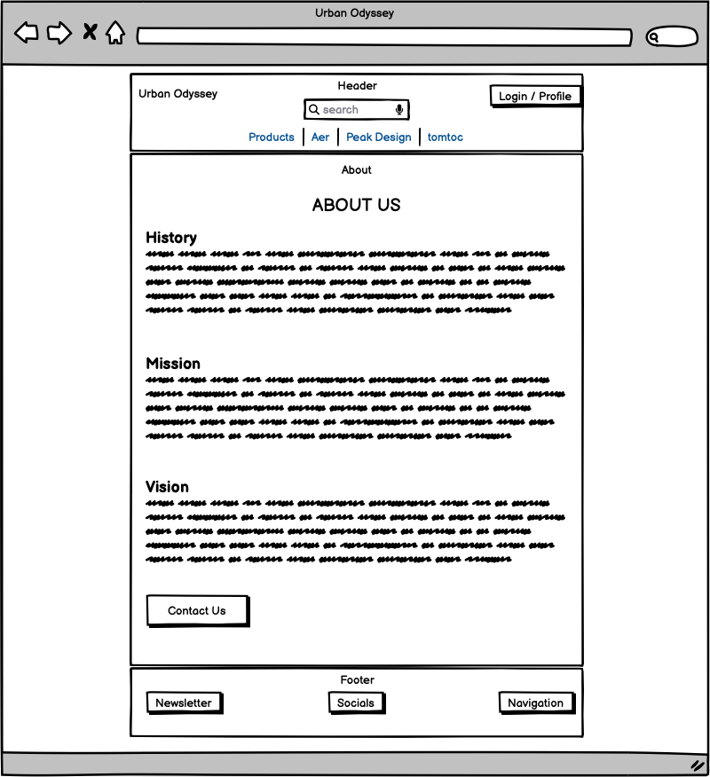

# Urban Odyssey
<a name="top"></a><br>


## Description

Welcome to Urban Odyssey, your go-to platform for stylish, durable, and minimalist everyday carry solutions. We partner with leading brands like Aer, Peak Design, and tomtoc to empower digital nomads and adventurers with products that combine innovation and style.

This project was developed as part of Code Institute's Full Stack Software Developer program.

## Live Demo

**Check out the live website here:** [Urban Odyssey!](https://urban-odyssey-d9c0f3df42fe.herokuapp.com/)

## Project Management

### Project Board

[Notion](https://www.notion.so/) is the application I used to work on my [Project Board](https://www.notion.so/Urban-Odyssey-12a9d8c205da8089a485cf101b551234?pvs=4) using an agile approach.

[Back to Top](#top)

## Design Choices

### Wireframes

I created wireframes for the key page sites using [Balsamiq](https://balsamiq.com/). The purpose was to outline the basic structure and layout of the website.

<details>
<summary><strong>Homepage</strong></summary>


</details>

<details>
<summary><strong>Product List</strong></summary>


</details>

<details>
<summary><strong>Product Detail</strong></summary>


</details>

<details>
<summary><strong>Shopping Bag</strong></summary>


</details>

<details>
<summary><strong>Checkout</strong></summary>


</details>

<details>
<summary><strong>Profile</strong></summary>


</details>

<details>
<summary><strong>Wishlist</strong></summary>


</details>

<details>
<summary><strong>FAQ</strong></summary>


</details>

<details>
<summary><strong>About</strong></summary>



</details>

<details>
<summary><strong>Contact Us</strong></summary>


</details>

### Database Design: Entity-Relationship Diagram (ERD)

The ERD below reflects the current state of the project. It shows the relationships between different entities in the Urban Odyssey system.

<details>
<summary><strong>Contact Us</strong></summary>


</details>

### Color Scheme

To maintain simplicity and a minimalist aesthetic, he primary color scheme for the site is black and white. I also used Bootstrap’s default colors to maintain consistency with the design patterns. These colors help to create a clean interface and incorporating an urban vibe.

<details>
<summary><strong>Color Palette</strong></summary>


</details>

### Typography

I used **Montserrat**, a modern sans-serif font, throughout the site. Its clean lines and readable design fit the overall minimalist theme.

[Back to Top](#top)

## Business Model and Marketing Strategies

### E-Commerce Business Model

Urban Odyssey operates as a **business-to-consumer (B2C)** e-commerce platform, providing premium everyday carry solutions tailored to the needs of digital nomads, urban adventurers, and style-conscious professionals.

### Target Audience

The primary audience for Urban Odyssey includes:
- **Digital Nomads**: Individuals seeking durable, portable, and versatile solutions for work and travel.
- **Urban Adventurers**: City dwellers who value stylish, functional, and minimalistic accessories.
- **Professionals on the Go**: Those who require dependable, high-quality gear for their dynamic, fast-paced lifestyles.

### Marketing Strategies

To engage with potential customers and drive sales, Urban Odyssey uses the following strategy:

1. **Search Engine Optimization (SEO)**:
- Optimized content with targeted keywords to improve search visibility, using [Wortracker](https://www.wordtracker.com/).
- Detailed product descriptions and **meta tags** to rank higher on search engines.
- **XML Sitemap** and **robots.txt** files included to ensure search engines can efficiently crawl and index the site.
- Utilization of **slugs** in models to generate clean, descriptive and SEO-friendly URLs.

2. **Social Media Marketing via Facebook**:<br>
A **Facebook page** that helps with engaging with the customers, sharing updates, showcasing products, and running targeted ad campaigns.

3. **Email Marketing Campaigns**:<br>
Through [Brevo](https://app.brevo.com/), I designed email newsletter subscription, which will play a major role in future marketing plans.

4. **Web Design**:<br>
The minimalist and stylish website design ensures a user-friendly shopping experience, appealing directly to the aesthetics and preferences of the target audience.

### Future Marketing Plans:

1. **Content Marketing**:
- Plans to create blog posts and guides that speak to the targeted audience. Topics will include travel tips and gear reviews.
- How-to videos and product demonstrations will be shared across multiple platforms, further expanding engagement.
- Newsletters to promote new arrivals, offer exclusive deals, and keep subscribers informed of brand developments.

2. **Additional Online Presence**:
- Building a more robust social media presence across various platforms.
- Increased content with future content marketing plans.

These strategies and future plans are designed to attract and retain customers while positioning Urban Odyssey as a leader in the e-commerce space for digital nomads and adventurers.

[Back to Top](#top)

## Deployment

### Preparing for Deployment

Before deploying to Heroku, ensure the following steps are completed:

1. **Clone the Repository**:<br>
Clone the project repository to your local machine:<br>
```git clone https://github.com/yanidruffy/urban-odyssey.git```

2. **Go to Project Directory**:<br>
```cd urban-odyssey```

3. **Set up Virtual Environment**:<br>
On MacOS/Linux:<br>
```python3 -m venv venv```<br>
```source venv/bin/activate```<br>

On Windows:<br>
```python -m venv venv```<br>
```venv\Scripts\activate```

4. **Install Dependencies**:<br>
Install the necessary packages from the requirements.txt file:<br>
```pip install -r requirements.txt```

5. **Configure Environment Variables (local Deployment)**:<br>
Create a .env file in the project root and add the required variables for this project:

Example of setting environment variables:<br>
```import os```<br>
```os.environ['DEVELOPMENT'] = 'True' or 'False'```<br>
```os.environ['SECRET_KEY'] = '<your-django-secret-key>'```<br>
```os.environ['DATABASE_URL'] = '<your-database-url>'```<br>
```os.environ['STRIPE_SECRET_KEY'] = '<your-stripe-secret-key>'```<br>
```os.environ['STRIPE_PUBLIC_KEY'] = '<your-stripe-public-key>'```<br>
```os.environ['STRIPE_WH_SECRET'] = '<your-stripe-webhook-secret>'```<br>
```os.environ['EMAIL_HOST_PASS'] = '<your-email-host-password>'```<br>
```os.environ['EMAIL_HOST_USER'] = '<your-email-host-username>'```<br>
```os.environ['AWS_ACCESS_KEY'] = '<your-aws-access-key>'```<br>
```os.environ['AWS_SECRET_ACCESS_KEY'] = '<your-aws-secret-access-key>'```<br>
```os.environ['USE_AWS'] = 'True' or 'False'```

Make sure to replace the placeholders with your actual values.

6. **Run Database Migration**:<br>
```python manage.py migrate```

7. **Test Locally**:<br>
```python manage.py runserver```
Open a browser and visit the page. Check for DEBUG settings (DEVELOPMENT in env.py).

## Heroku Deployment

### 1. Heroku Setup
1. Create an account on [Heroku](https://www.heroku.com/) if you don't already have one.
2. After logging in, click **New** in the dashboard and select **Create new app**.
3. Enter a unique app name, choose your region, and click **Create App**.

<details>
<summary><strong>Heroku Setup</strong></summary>


</details>

### 2. Connecting to a GitHub Repository
1. Navigate to the **Deploy** tab of your Heroku app.
2. Under **Deployment method**, select **GitHub**.
3. Authenticate and search for your repository name, then click **Connect**.

<details>
<summary><strong>Connect GitHub Repository</strong></summary>


</details>

### 3. Configuring Environment Variables
1. Navigate to the **Settings** tab in your Heroku app dashboard.
2. Click **Reveal Config Vars** to add the necessary environment variables.
3. Include all required variables for your application

Ensure that each variable corresponds to a value defined in your project's settings and `.env` file in order for the application to function properly.

<details>
<summary><strong>Settings Config & Buildpacks</strong></summary>


</details>

### 4. Adding Buildpacks
1. Scroll down in the **Settings** tab to the **Buildpacks** section.
2. Add the following buildpack:
	- `python`

<details>
<summary><strong>Adding Buildpacks</strong></summary>


</details>

### 5. Deploying the Application
1. In the **Deploy** tab, scroll to **Manual Deploy**.
2. Select your branch (e.g., `main`) and click **Deploy Branch**.
3. Optionally, enable **Automatic Deploys** for continuous deployment.

<details>
<summary><strong>Manual Deployment</strong></summary>


</details>

### 6. Finalizing Deployment
1. After deployment, you’ll see a success message with a **View** button.
2. Click **View** to visit your live site.

<details>
<summary><strong>Deployment Success</strong></summary>


</details>
