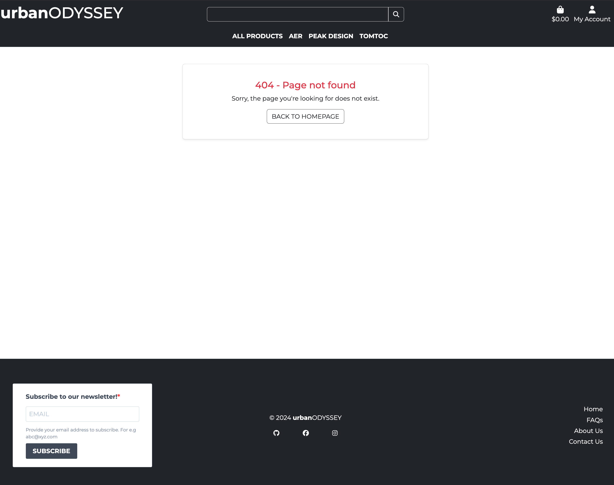
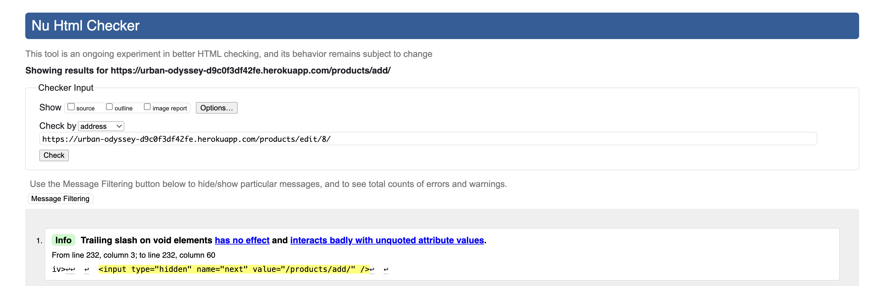

# Urban Odyssey
<a name="top"></a><br>


## Description

Welcome to Urban Odyssey, your go-to platform for stylish, durable, and minimalist everyday carry solutions. We partner with leading brands like Aer, Peak Design, and tomtoc to empower digital nomads and adventurers with products that combine innovation and style.

This project was developed as part of Code Institute's Full Stack Software Developer program.

## Live Demo

**Check out the live website here:** [Urban Odyssey!](https://urban-odyssey-d9c0f3df42fe.herokuapp.com/)

## Project Management

### Project Board - User Stories

[Notion](https://www.notion.so/) is the application I used to work on my [Project Board](https://www.notion.so/Urban-Odyssey-12a9d8c205da8089a485cf101b551234?pvs=4) using an agile approach.

Visit the live website here: [Urban Odyssey User Stories](https://intriguing-caper-d96.notion.site/12b9d8c205da8025af09d76a0dcb2f6a?v=d6e9d0b76d72415dac48133e5cab38d6)

[Back to Top](#top)

### Entity-Relationship Diagram (ERD)

The ERD below reflects the current state of the project. It shows the relationships between different entities in the Urban Odyssey system.

<details>
<summary><strong>ERD</strong></summary>


</details>

### Wireframes

I created wireframes for the key page sites using [Balsamiq](https://balsamiq.com/). The purpose was to outline the basic structure and layout of the website.

<details>
<summary><strong>Homepage</strong></summary>


</details>

<details>
<summary><strong>Product List</strong></summary>


</details>

<details>
<summary><strong>Product Detail</strong></summary>


</details>

<details>
<summary><strong>Shopping Bag</strong></summary>


</details>

<details>
<summary><strong>Checkout</strong></summary>


</details>

<details>
<summary><strong>Profile</strong></summary>


</details>

<details>
<summary><strong>Wishlist</strong></summary>


</details>

<details>
<summary><strong>FAQ</strong></summary>


</details>

<details>
<summary><strong>About</strong></summary>


</details>

<details>
<summary><strong>Contact Us</strong></summary>


</details>

### Color Scheme

To maintain simplicity and a minimalist aesthetic, the primary color scheme for the site is black and white. I also used Bootstrap’s default colors to maintain consistency with the design patterns. These colors help to create a clean interface and incorporating an urban vibe.

<details>
<summary><strong>Color Palette</strong></summary>


</details>

### Typography

I used **Montserrat**, a modern sans-serif font, throughout the site. Its clean lines and readable design fit the overall minimalist theme.

[Back to Top](#top)

## Business Model and Marketing Strategies

### E-Commerce Business Model

Urban Odyssey operates as a **business-to-consumer (B2C)** e-commerce platform, providing premium everyday carry solutions tailored to the needs of digital nomads, urban adventurers, and style-conscious professionals.

### Target Audience

The primary audience for Urban Odyssey includes:
- **Digital Nomads**: Individuals seeking durable, portable, and versatile solutions for work and travel.
- **Urban Adventurers**: City dwellers who value stylish, functional, and minimalistic accessories.
- **Professionals on the Go**: Those who require dependable, high-quality gear for their dynamic, fast-paced lifestyles.

### Marketing Strategies

To engage with potential customers and drive sales, Urban Odyssey uses the following strategy:

1. **Search Engine Optimization (SEO)**:
- Optimized content with targeted keywords to improve search visibility, using [Wortracker](https://www.wordtracker.com/).
- Detailed product descriptions and **meta tags** to rank higher on search engines.
- **XML Sitemap** and **robots.txt** files included to ensure search engines can efficiently crawl and index the site.
- Utilization of **slugs** in models to generate clean, descriptive and SEO-friendly URLs.

2. **Social Media Marketing via Facebook**:<br>
A **Facebook page** that helps with engaging with the customers, sharing updates, showcasing products, and running targeted ad campaigns.

<details>
<summary><strong>Company Facebook Page</strong></summary>


</details>

3. **Email Marketing Campaigns**:<br>
Through [Brevo](https://app.brevo.com/), I designed email newsletter subscription, which will play a major role in future marketing plans.

<details>
<summary><strong>Newsletter List</strong></summary>


</details>

4. **Web Design**:<br>
The minimalist and stylish website design ensures a user-friendly shopping experience, appealing directly to the aesthetics and preferences of the target audience.

### Future Marketing Plans:

1. **Content Marketing**:
- Plans to create blog posts and guides that speak to the targeted audience. Topics will include travel tips and gear reviews.
- How-to videos and product demonstrations will be shared across multiple platforms, further expanding engagement.
- Newsletters to promote new arrivals, offer exclusive deals, and keep subscribers informed of brand developments.

2. **Additional Online Presence**:
- Building a more robust social media presence across various platforms.
- Increased content with future content marketing plans.

These strategies and future plans are designed to attract and retain customers while positioning Urban Odyssey as a leader in the e-commerce space for digital nomads and adventurers.

[Back to Top](#top)

## Features

### Homepage
- **Header & Navigation**:
	- **Hamburger Menu**: A collapsible menu on mobile devices that provides easy access to all sections of the site, including products, wishlist, and contact.
	- **Search Bar**: Users can search for products directly from the mobile header.
	- **Sticky Header**: The header remains visible while scrolling on mobile devices, allowing quick access to navigation options.
	- **Quick Access**: Provides links to key sections of the website including the homepage, product categories, shopping bag, and user account.
	- **User Authentication**: Displays login and account creation options for registered users.
- **Dynamic Carousel**: Displays a carousel with images of different backpack brands (TomToc, Aer, Peak Design) and links to their respective product category pages.
- **Company Information**: Includes company statements that highlight the mission and vision of Urban Odyssey.
- **Top-Rated Products**: Displays top-rated products, helping users easily find popular items.
- **FAQ Section**: A few FAQs are displayed directly on the homepage for easy access to common queries.
- **Footer**:
	- **Newsletter Signup**: Users can subscribe to the newsletter.
	- **Social Media Icons**: Displays icons that link to the company’s social media profiles.
	- **Site Links**: Provides links to important sections of the website.

<details>
<summary><strong>Homepage Screenshot</strong></summary>


</details>

<details>
<summary><strong>Newsletter Confirmation Screenshot</strong></summary>


</details>

### Product List
- **Product Categories**: Displays products from Aer, Peak Design, and tomtoc, when it is available.
- **Product Details**: Each product includes an image, product name, prices, and ratings, helping users make informed decisions.
- **Category Navigation**: Users can browse products by different categories such as backpacks, accessories, and other product types.
- **Admin Control**: Superusers see Edit and Delete buttons for each product, enabling quick management directly from the product list view.

<details>
<summary><strong>Product List Screenshot</strong></summary>


</details>

### Product Detail
- **Comprehensive Product View**: Users can explore large, high-quality images alongside detailed descriptions and specifications for each product.
- **Product Rating**: Displays the overall rating, giving users insights into product popularity and quality.
- **Wishlist Integration**: Logged-in users can save products to their wishlist for future consideration.
- **Seamless Purchase Options**: Enables users to select quantities and add items directly to their shopping bag.
- **Admin Control**: Superusers see Edit and Delete buttons for each product, enabling quick management directly from the product list view.

<details>
<summary><strong>Product Detail Screenshot</strong></summary>


</details>

### Shopping Bag
- **Item Management**: Users can add items to the bag, view item details (images, descriptions, prices), and adjust quantities.
- **Remove Items**: Users can remove items from the bag if they decide not to purchase them.
- **Order Summary**: A summary of the order, including subtotal, shipping costs, taxes, and the total cost, is displayed.

<details>
<summary><strong>Shopping bag Screenshot</strong></summary>


</details>

### Checkout
- **Secure Payments**: Users can make payments via **Stripe**, a secure and trusted payment gateway.
- **Order Confirmation**: Displays the order summary and delivery details before finalizing the purchase.
- **Delivery Information**: Users can enter and save delivery details if logged in for a quicker checkout experience.
- **Guest Checkout**: Allows users to complete their purchase without needing to create an account.

<details>
<summary><strong>Checkout Screenshot</strong></summary>


</details>

### Checkout Success
- **Order Confirmation**: Displays a confirmation message thanking users for their order, along with a confirmation email sent to their provided address.
- **Order Summary**: Provides a detailed summary of the order, including item names, quantities, individual prices, subtotal, delivery cost, and grand total.
- **Delivery Address**: Displays the delivery address users provided during checkout.
- **Confirmation Number**: Highlights a unique confirmation number for the order, which users can reference for tracking or inquiries.
- **Navigation Options**:
	- If users come from their profile, they can return to the profile page.
	- Alternatively, users can navigate to the product list to continue shopping.

<details>
<summary><strong>Checkout Success Screenshot</strong></summary>


</details>

<details>
<summary><strong>Stripe Screenshot</strong></summary>


</details>

### User Profiles
- **Profile Management**: Users can view and update their delivery information.
- **Save Delivery Information**: Users have the option to save their delivery details for future orders.

<details>
<summary><strong>User Profile Screenshot</strong></summary>


</details>

### Wishlist
- **Save Favorites**: Registered users can add products to their wishlist to keep track of items they may want to purchase later.
- **Easy Access**: Users can view, or remove items from their wishlist directly.

<details>
<summary><strong>Wishlist Screenshot</strong></summary>


</details>

### FAQ Section
- **Comprehensive FAQ**: Users can find answers to common questions about the platform, shipping, returns, and more.
- **Admin Management**: Admins can add, edit, or delete FAQs via the admin interface to keep content up-to-date.

<details>
<summary><strong>FAQ Screenshot</strong></summary>


</details>

### About Us
- **Company Overview**: Displays information about the company’s history, mission, and vision.
- **Contact Link**: A button allowing users to easily navigate to the Contact Us page for further inquiries.

<details>
<summary><strong>About Us Screenshot</strong></summary>


</details>

### Contact Us
- **Contact Form**: Users can fill out a form to contact Urban Odyssey for support or inquiries.
- **Message Management**: Admins can view, mark as read, and manage submitted messages via the Django admin interface.

<details>
<summary><strong>Contact Us Screenshot</strong></summary>


</details>

### Toast Notifications
- **Real-Time Feedback**: Toast messages provide users with instant feedback on their actions, such as adding items to the cart or encountering errors.

<details>
<summary><strong>Toast Notification Screenshot</strong></summary>


</details>

### Error Handling
- **Custom Error Pages**: Custom 404 and 500 error pages to ensure a user-friendly experience in case of missing pages or server errors.

<details>
<summary><strong>404 Screenshot</strong></summary>



</details>

### Authentication
- **User Registration & Login**: Secure user authentication with registration, login, and password recovery features through Allauth.

<details>
<summary><strong>Password Reset Screenshot</strong></summary>


</details>

### Admin Panel
- **Comprehensive Management**: The Django Admin Panel allows superusers to efficiently manage various aspects of the website.

<details>
<summary><strong>Admin Panel Screenshot</strong></summary>


</details>

[Back to Top](#top)

## Testing

### Validation

#### HTML Validation

HTML files have been validated using [W3C Markup Validation Service](https://validator.w3.org/)

| Page            | Errors | Warnings | Info |
|-----------------|--------|----------|------|
| homepage        | 0      | 0        | 0    |
| products        | 0      | 0        | 0    |
| product detail  | 0      | 0        | 0    |
| product add     | 0      | 0        | 1    |
| product edit    | 0      | 0        | 1    |
| product delete  | 0      | 0        | 1    |
| bag             | 0      | 0        | 0    |
| checkout        | 0      | 0        | 0    |
| checkout success| 0      | 0        | 0    |
| profile         | 0      | 0        | 1    |
| wishlist        | 0      | 0        | 1    |
| wishlist remove | 0      | 0        | 1    |
| faq             | 0      | 0        | 0    |
| faq add         | 0      | 0        | 1    |
| faq edit        | 0      | 0        | 1    |
| faq delete      | 0      | 0        | 1    |
| about           | 0      | 0        | 0    |
| contact         | 0      | 0        | 0    |
| login           | 0      | 0        | 0    |
| signup          | 0      | 0        | 0    |
| logout          | 0      | 0        | 0    |

<details>
<summary><strong>HTML Validation Result Images</strong></summary>





</details>

#### CSS Validation

CSS files have been validated using [W3C CSS Validation Service](https://jigsaw.w3.org/css-validator/)

<details>
<summary><strong>CSS Validation Results</strong></summary>


| CSS File  | Errors | Warnings |
|-----------|--------|----------|
| base      | 0      | 2        |
| checkout  | 0      | 1        |

</details>

#### Javascript Code Analyzer

JS files have been analyzed using [JS Hint](https://jshint.com/)<br>
Script tags were removed before testing to focus solely on the JavaScript code.

<details>
<summary><strong>JS Hint Results</strong></summary>


</details>

#### Python Validation

All altered Python files have been checked with **flake8** and validated using [CI Python Linter](https://pep8ci.herokuapp.com/)

<details>
<summary><strong>PEP8 Results</strong></summary>

All files came back with a Result of: All clear, no errors found


The screenshots for the other validated files can be found in the [PEP8 Folder](./docs/testing_images/pep8/)

</details>

[Back to Top](#top)

### Lighthouse

The Lighthouse reports have been generated to audit the website for performance, accessibility, best practices, and SEO across various key pages.

All images used in my website have been compressed using [TinyPNG](https://tinypng.com/).

<details>
<summary><strong>Lighthouse Results</strong></summary>

Performance and Accessibility need some work, Best Practices and SEO scores are excellent.

1. **Homepage**
- Desktop: 
- Mobile: 

2. **Products**
- Desktop: 
- Mobile: 

3. **Product Detail**
- Desktop: 
- Mobile: 

4. **Profile**
- Desktop: 
- Mobile: 

5. **Bag**
- Desktop: 
- Mobile: 

6. **Checkout**
- Desktop: 
- Mobile: 

7. **Wishlist**
- Desktop: 
- Mobile: 

8. **FAQ**
- Desktop: 
- Mobile: 

9. **About Us**
- Desktop: 
- Mobile: 

10. **Contact Us**
- Desktop: 
- Mobile: 

</details>

[Back to Top](#top)

## Manual Testing

### Home Page
| Feature | Test | Result | Status |
|---------|------|--------|--------|
| **Header** | 1. Click logo to go to homepage.<br>2. Test search bar.<br>3. Click account icon. | Logo redirects correctly.<br>Search works.<br>Account options appear. | &check; |
| **Carousel** | 1. Check if carousel shows all images automatically.<br>2. Test each link. | All images show.<br>Links work. | &check; |
| **Company Statement** | 1. Verify the statement or placeholder is visible. | Statement is visible and matches the content. | &check; |
| **Top-Rated Products** | 1. Check if products appear with details.<br>2. Verify links work. | Products show with correct info.<br>Links work. | &check; |
| **Navigation Menu** | 1. Click each link.<br>2. Test on mobile. | Links go to the right pages.<br>Works on mobile. | &check; |
| **Footer** | 1. Test newsletter.<br>2. Verify links. | Newsletter works.<br>Footer links work. | &check; |

### Product List
| Feature | Test | Result | Status |
|---------|------|--------|--------|
| **Product Display** | 1. Check if all available products appear.<br>2. Test if the correct category name is displayed.<br> | All products show correctly.<br>Category names and images are correct. | &check; |
| **Product Details Link** | 1. Click on a product.<br>2. Check if it redirects to the product detail page. | Redirects to correct product detail page. | &check; |
| **Admin Features** | 1. Check visibility of "Edit" and "Delete" links for admins.<br>2. Test if "Edit" and "Delete" links work. | Admin links appear only for superusers.<br>Edit and Delete links work. | &check; |
| **Free Delivery Info** | 1. Check if the free delivery threshold is displayed.<br>2. Verify the threshold value is correct. | Free delivery info shows correctly.<br>Value is accurate. | &check; |

### Product Detail
| Feature | Test | Result | Status |
|---------|------|--------|--------|
| **Product Image** | 1. Verify product image appears.<br>2. Test link to open image in a new tab. | Product image shows.<br>Link works. | &check; |
| **Product Description** | 1. Check if product description is visible. | Description shows correctly. | &check; |
| **Add to Wishlist** | 1. Test "Add to Wishlist" button for logged-in users.<br>2. Verify button redirects to login for guests. | Button works for logged-in users.<br>Redirects to login for guests. | &check; |
| **Add to Bag** | 1. Test the "Add to Bag" button.<br>2. Verify the correct quantity input.<br>3. Ensure it adds product to the bag. | Button adds product to bag.<br>Quantity input works. | &check; |
| **Admin Features** | 1. Check visibility of "Edit" and "Delete" links for admins.<br>2. Test if "Edit" and "Delete" links work. | Admin links appear only for superusers.<br>Edit and Delete links work. | &check; |

### Add/Edit/Delete Product
| Feature | Test | Result | Status |
|---------|------|--------|--------|
| **Product Form** | 1. Check if form loads correctly.<br>2. Verify that form submission works. | Form loads with all fields.<br>Form submits correctly. | &check; |
| **Edit Product Form** | 1. Check if form loads with pre-filled data.<br>2. Test if all fields are editable.<br>3. Verify form submission works. | Form loads with correct data.<br>Fields are editable.<br>Form submits correctly. | &check; |
| **Delete Confirmation** | 1. Check if delete confirmation page loads.<br>2. Verify that product name appears.<br>3. Test if "Confirm Delete" works.<br>4. Test if "Cancel" redirects correctly. | Confirmation page loads.<br>Correct product name shows.<br>Delete and Cancel buttons work. | &check; |

### Bag
| Feature  | Test | Result | Status |
|----------|------|--------|--------|
| **Product Image** | 1. Verify product image appears.| Product image displays correctly.<br>Fallback image shows if no product image. | &check; |
| **Product Info** | 1. Verify product info appears.<br>2. Check if subtotal updates correctly. | Product info displays correctly.<br>Subtotal updates. | &check; |
| **Quantity Buttons** | 1. Test increment and decrement buttons.<br>2. Verify quantity input accepts values. | Buttons increment/decrement<br>and input works as expected. | &check; |
| **Remove Item** | 1. Verify "Remove" button removes item from the bag.<br>2. Check if bag updates correctly after removal. | Item is removed.<br>Bag updates accordingly. | &check; |
| **Order Summary** | 1. Verify Bag Total, Delivery and Grand Total display correctly. | Totals show correctly with free delivery message when eligible | &check; |
| **Checkout** | 1. Verify "Secure Checkout" button redirects to checkout page. | Button redirects to checkout page. | &check; |
| **Keep Shopping** | 1. Test "Keep Shopping" button redirects to product list. | Button redirects to product list page. | &check; |
| **Empty Message** | 1. Verify "Your bag is empty" message shows when no items in the bag. | Message displays correctly. | &check; |

### Checkout
| Feature | Test | Result | Status |
|---------|------|--------|--------|
| **Order Summary** | 1. Verify order items appear.<br>2. Ensure subtotals and grand total update correctly. | Order items display correctly.<br>Totals update. | &check; |
| **Product Image** | 1. Check if product images appear for each item. | Product images display correctly. | &check; |
| **Delivery Address** | 1. Verify delivery address displays correctly. | Address show correctly. | &check; |
| **Order Form** | 1. Verify all form fields load correctly.<br>2. Test form submission. | Form loads with all fields.<br>Form submits correctly. | &check; |
| **Save Info Option** | 1. Test checkbox for saving delivery info.<br>2. Verify link to create or login to an account. | Checkbox works.<br>Links redirect to login/signup. | &check; |
| **Payment Section** | 1. Verify Stripe card input is visible.<br>2. Check if errors are displayed for invalid inputs. | Card input displays.<br>Errors appear for invalid data. | &check; |
| **Complete Order** | 1. Test "Complete Order" button.<br>2. Verify confirmation page redirects. | Button redirects to confirmation page. | &check; |
| **Back to Bag** | 1. Verify "Adjust Bag" button redirects to the bag page. | Button redirects to bag page. | &check; |
| **Confirmation** | 1. Verify confirmation message after successful order.<br>2. Check if order number is shown. | Confirmation message and order number display. | &check; |
| **Continue Shopping** | 1. Verify "Continue Shopping" button redirects to product list. | Button redirects to product list. | &check; |

### Profile
| Feature | Test | Result | Status |
|---------|------|--------|--------|
| **Profile Heading** | 1. Verify "My Profile" heading is displayed. | Heading displays correctly. | &check; |
| **Delivery Information Form** | 1. Verify delivery form is displayed.<br>2. Test form submission and updates. | Form is displayed correctly.<br>Form updates with valid input. | &check; |
| **Order History Section** | 1. Verify orders are displayed.<br>2. Check if "No orders found" message displays when empty. | Orders show correctly.<br>No orders message appears if applicable. | &check; |
| **Order Link** | 1. Verify clicking an order link redirects to order details. | Link redirects correctly to order history. | &check; |

### Wishlist
| Feature | Test | Result | Status |
|---------|------|--------|--------|
| **Wishlist Heading** | 1. Verify "My Wishlist" heading is displayed. | Heading is displayed correctly. | &check; |
| **Wishlist Items Display** | 1. Check if wishlist items are displayed when available.<br>2. Ensure "Your wishlist is empty" message appears when no items exist. | Wishlist items show correctly.<br>Empty wishlist message appears if applicable. | &check; |
| **Product Details Button** | 1. Verify "View" button for each item links to product detail page. | Button redirects correctly to product detail page.         | &check; |
| **Remove Item Button** | 1. Test if "Remove" button removes the item from the wishlist.<br>2. Check if wishlist updates after removal. | Item is removed correctly.<br>Wishlist updates after removal. | &check; |
| **Clear Wishlist Button** | 1. Verify "Clear Wishlist" button.<br>2. Test if clicking clears all wishlist items and redirects correctly. | Button clears the wishlist and redirects to wishlist page. | &check; |
| **Confirm Deletion Page** | 1. Verify deletion confirmation page appears when clearing the wishlist.<br>2. Test if confirmation button deletes all items. | Confirmation page displays correctly.<br>Items are deleted after confirmation. | &check; |
| **Cancel Button** | 1. Verify "Cancel" button redirects back to the wishlist without deleting items. | Button redirects correctly without deletion. | &check; |

### FAQ
| Feature | Test | Result | Status |
|---------|------|--------|--------|
| **FAQ List Heading** | 1. Verify the "Frequently Asked Questions" heading is displayed. | Heading is displayed correctly. | &check; |
| **FAQ Display** | 1. Check if FAQs are displayed properly with question and answer. | FAQs show correctly with questions and answers. | &check; |
| **Edit/Delete Links** | 1. Ensure "Edit" and "Delete" links are visible for admin users.<br>2. Verify that these links redirect to the respective edit or delete page. | Links are shown for admin users only.<br>Redirection works correctly. | &check; |
| **Published/Not Published Badge** | 1. Check if the "Published" and "Not Published" badges are displayed for each FAQ. | Badges display correctly based on FAQ status. | &check; |
| **Add FAQ Button** | 1. Verify that the "Add FAQ" button is available for admin users.<br>2. Test if clicking redirects to the "Add FAQ" form. | Button displays for admin users.<br>Redirection works correctly. | &check; |
| **Add FAQ Form** | 1. Check if the form includes all fields.<br>2. Verify form submission works and redirects to FAQ list. | Form includes necessary fields.<br>Form submits and redirects correctly. | &check; |
| **Edit FAQ Form** | 1. Verify "Edit FAQ" page contains pre-filled form with the selected FAQ details.<br>2. Ensure changes are saved correctly. | Form is pre-filled with current data.<br>Changes are saved and reflected. | &check; |
| **Delete FAQ Confirmation** | 1. Test if "Delete FAQ" redirects to confirmation page.<br>2. Verify FAQ deletion works after confirmation. | Confirmation page appears.<br>FAQ is deleted after confirmation. | &check; |
| **Cancel Delete** | 1. Verify "Cancel" button redirects back to FAQ list without deletion. | Button redirects correctly without deleting the FAQ. | &check; |

### About Us
| Feature | Test | Result | Status |
|---------|------|--------|--------|
| **Page (Sub-)Heading** | 1. Verify that all dynamic headings are displayed. | Headings are displayed correctly. | &check; |
| **About Us Content** | 1. Check if the content or placeholder are displayed. | Content is displayed correctly. | &check; |
| **Contact Us Button** | 1. Verify the "Contact Us" button is displayed.<br>2. Check if the button redirects to the contact page. | Button is visible.<br>Redirection to contact page works. | &check; |

### Contact Us
| Feature | Test | Result | Status |
|---------|------|--------|--------|
| **Page Heading** | 1. Verify the "Contact Us" heading is displayed at the top of the form. | Heading is displayed correctly. | &check; |
| **Form Display** | 1. Ensure the contact form is visible with all fields. | Contact form is displayed correctly. | &check; |
| **Form Submission** | 1. Submit the form with data.<br>2. Verify that the submission is processed accordingly. | Form submission works as expected. | &check; |

### Allauth Core Functionality

| Feature | Test | Result | Status |
|---------|------|--------|--------|
| **Registration** | Fill out and submit the form. | User is registered or shown appropriate error messages for issues. | &check; |
| **Login** | Enter credentials and submit the form. | User is logged in or shown appropriate error messages for issues. | &check; |
| **Logout** | Confirm logout. | User is logged out. | &check; |
| **Password Reset** | Submit an email for password reset.<br>3. Follow the email link and set a new password. | User receives reset email. | &check; |

[Back to Top](#top)

## Encountered Bugs

## Bugs

| **Date** | **Issue** | **Solution** |
|----------|-----------|--------------|
| 22.11. | Search bar did not return results for "Peak Design." | Updated search functionality to include category name |
| 24.11. | Delivery fee appeared when the bag was empty. | Adjusted `contexts.py` to ensure delivery fee is only calculated when the total is greater than 0. |
| 26.11. | Quantity input could go below 1, and decrement button was not disabled. | Added IDs to inputs and updated JavaScript to enable/disable buttons based on the input value. |
| 09.12. | Credit card input field overlaps at a screen size of 320px. | Unsolved |

Further bug fixes can be found in my commits.

[Back to Top](#top)

## Deployment

### Preparing for Deployment

Before deploying to Heroku, ensure the following steps are completed:

1. **Clone the Repository**:<br>
Clone the project repository to your local machine:<br>
```git clone https://github.com/yanidruffy/urban-odyssey.git```

2. **Go to Project Directory**:<br>
```cd urban-odyssey```

3. **Set up Virtual Environment**:<br>
On MacOS/Linux:<br>
```python3 -m venv venv```<br>
```source venv/bin/activate```<br>

On Windows:<br>
```python -m venv venv```<br>
```venv\Scripts\activate```

4. **Install Dependencies**:<br>
Install the necessary packages from the requirements.txt file:<br>
```pip install -r requirements.txt```

5. **Configure Environment Variables (local Deployment)**:<br>
Create a .env file in the project root and add the required variables for this project:

Example of setting environment variables:<br>
```import os```<br>
```os.environ['DEVELOPMENT'] = 'True' or 'False'```<br>
```os.environ['SECRET_KEY'] = '<your-django-secret-key>'```<br>
```os.environ['DATABASE_URL'] = '<your-database-url>'```<br>
```os.environ['STRIPE_SECRET_KEY'] = '<your-stripe-secret-key>'```<br>
```os.environ['STRIPE_PUBLIC_KEY'] = '<your-stripe-public-key>'```<br>
```os.environ['STRIPE_WH_SECRET'] = '<your-stripe-webhook-secret>'```<br>
```os.environ['EMAIL_HOST_PASS'] = '<your-email-host-password>'```<br>
```os.environ['EMAIL_HOST_USER'] = '<your-email-host-username>'```<br>
```os.environ['AWS_ACCESS_KEY'] = '<your-aws-access-key>'```<br>
```os.environ['AWS_SECRET_ACCESS_KEY'] = '<your-aws-secret-access-key>'```<br>
```os.environ['USE_AWS'] = 'True' or 'False'```

Make sure to replace the placeholders with your actual values.

6. **Run Database Migration**:<br>
```python manage.py migrate```

7. **Test Locally**:<br>
```python manage.py runserver```
Open a browser and visit the page. Check for DEBUG settings (DEVELOPMENT in env.py).

### Heroku Deployment

#### 1. Heroku Setup
1. Create an account on [Heroku](https://www.heroku.com/) if you don't already have one.
2. After logging in, click **New** in the dashboard and select **Create new app**.
3. Enter a unique app name, choose your region, and click **Create App**.

<details>
<summary><strong>Heroku Setup</strong></summary>


</details>

#### 2. Connecting to a GitHub Repository
1. Navigate to the **Deploy** tab of your Heroku app.
2. Under **Deployment method**, select **GitHub**.
3. Authenticate and search for your repository name, then click **Connect**.

<details>
<summary><strong>Connect GitHub Repository</strong></summary>


</details>

#### 3. Configuring Environment Variables
1. Navigate to the **Settings** tab in your Heroku app dashboard.
2. Click **Reveal Config Vars** to add the necessary environment variables.
3. Include all required variables for your application

Ensure that each variable corresponds to a value defined in your project's settings and `.env` file in order for the application to function properly.

<details>
<summary><strong>Settings Config & Buildpacks</strong></summary>


</details>

#### 4. Adding Buildpacks
1. Scroll down in the **Settings** tab to the **Buildpacks** section.
2. Add the following buildpack:
	- `python`

<details>
<summary><strong>Adding Buildpacks</strong></summary>


</details>

#### 5. Deploying the Application
1. In the **Deploy** tab, scroll to **Manual Deploy**.
2. Select your branch (e.g., `main`) and click **Deploy Branch**.
3. Optionally, enable **Automatic Deploys** for continuous deployment.

<details>
<summary><strong>Manual Deployment</strong></summary>


</details>

#### 6. Finalizing Deployment
1. After deployment, you’ll see a success message with a **View** button.
2. Click **View** to visit your live site.

<details>
<summary><strong>Deployment Success</strong></summary>


</details>

[Back to Top](#top)

## Technologies Used

### Libraries & Frameworks
- **Django**: Backend framework for structuring the application.
- **Python**: Programming language used for development.
- **Bootstrap 5**: Frontend framework for responsive design.
- **django-allauth**: Authentication and user management.
- **django-storages**: Manages file storage with AWS S3.
- **django-crispy-forms**: Enhances Django forms with Bootstrap 5.
- **django-countries**: Adds country selection to forms.
- **boto3**: AWS SDK for interacting with AWS services.
- **Pillow**: Image processing library for handling images.
- **Graphviz**: Creates visual diagrams and graphs.

### Payment & Cloud Services
- **Stripe**: Payment processing service for transactions.
- **AWS S3**: Cloud storage for files.
- **Heroku**: Cloud platform for app deployment.

### Frontend Technologies
- **HTML**: Markup language for structuring content.
- **CSS**: Stylesheet language for web page design.
- **JavaScript**: Interactivity and dynamic content.

### Other Tools & Integrations
- **PostgreSQL**: Database for storing data.
- **CodeInstitute IDE**: Online IDE using Gitpod.
- **VS Code**: Editor for writing code.

[Back to Top](#top)

## **Credits**

- **[Aer](https://aersf.com/), [Peak Design](https://www.peakdesign.com/eu/), and [tomtoc](https://www.tomtoc.com/)**: Brands featured in the product images. All used for learning purposes, no harm intended.
- **[Balsamiq](https://balsamiq.com/)**: Used for creating wireframes.
- **[Boutique Ado Project](https://github.com/Code-Institute-Solutions/boutique_ado_v1) by Code Institute**: The foundation for this project, serving as a starting point for the development of Urban Odyssey.
- **[ChatGPT](https://chatgpt.com/)**: Used for content text, and debugging.
- **[Coolors](https://coolors.co/)**: Used for selecting color schemes for the project.
- **[DeepAI](https://deepai.org/)**: Used for generating AI-based images for my mockup Facebook page.
- **[Favicon](https://favicon.io/)**: Provided the favicon used in the project.
- **[Google Fonts](https://fonts.google.com/)**: Provided 'Montserrat' font used in the project.
- **[Brevo](https://www.brevo.com/de/)**: Email marketing service for campaigns.
- **[Temp-Mail](https://temp-mail.org/de/)**: Provided temporary email addresses for testing purposes.
- **[TinyPNG](https://tinypng.com/)**: Optimized images for faster load times.

[Back to Top](#top)

## Acknowledgements

I would like to express my gratitude to the following individuals and resources for their support:

- **[Code Institute](https://codeinstitute.net/global/)**: Special thanks to tutor support, my cohort facilitator, and my mentor for their continuous assistance throughout the development process.

- **Mentors and Peers**: Special thanks to my colleagues who supported and encouraged me throughout the entire course, staying with me until the finish line. To [Marceillo](https://github.com/Marceillo) and [Sebastian](https://github.com/Mienjung97/) for their invaluable feedback, motivation, and camaraderie during this journey.

- **Family and Friends**: To my family and friends for their constant support, understanding, and encouragement, which gave me the strength to persevere and complete my program.

[Back to Top](#top)
